# Mahasiswa Leveling Client SPA Service

This repository is a client service for Mahasiswa Leveling SPA. This service is built using [ReactJS](https://reactjs.org/), [Chakra UI](https://chakra-ui.com/), [Vite](https://vitejs.dev/), and [TypeScript](https://www.typescriptlang.org/).

## Setup and Installation

### Prerequisites
- [NodeJS](https://nodejs.org/en/)

### Installation

#### Local
1. Clone this repository
2. Install dependencies
```bash
npm install
```
3. Run the service
```bash
npm run dev
```

#### Docker
1. Clone this repository
2. Build the image
```bash
docker-compose build
```
3. Run the container
```bash
docker-compose up
```

## Screenshots
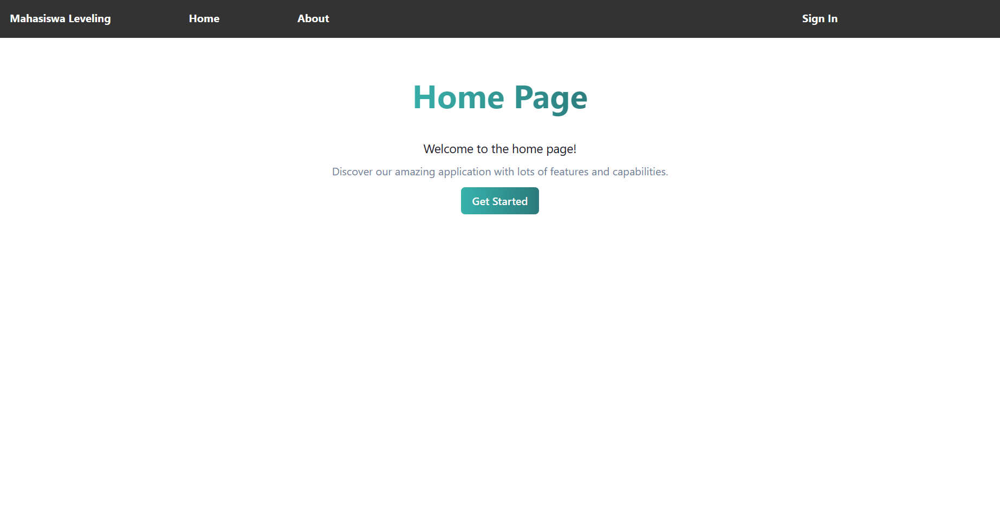
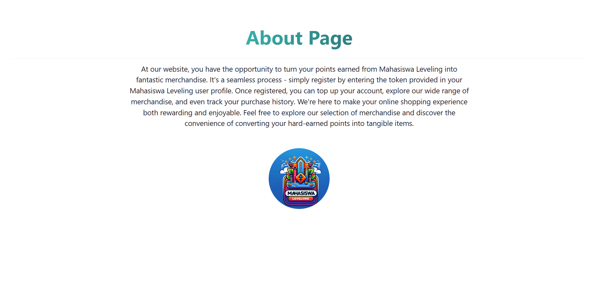
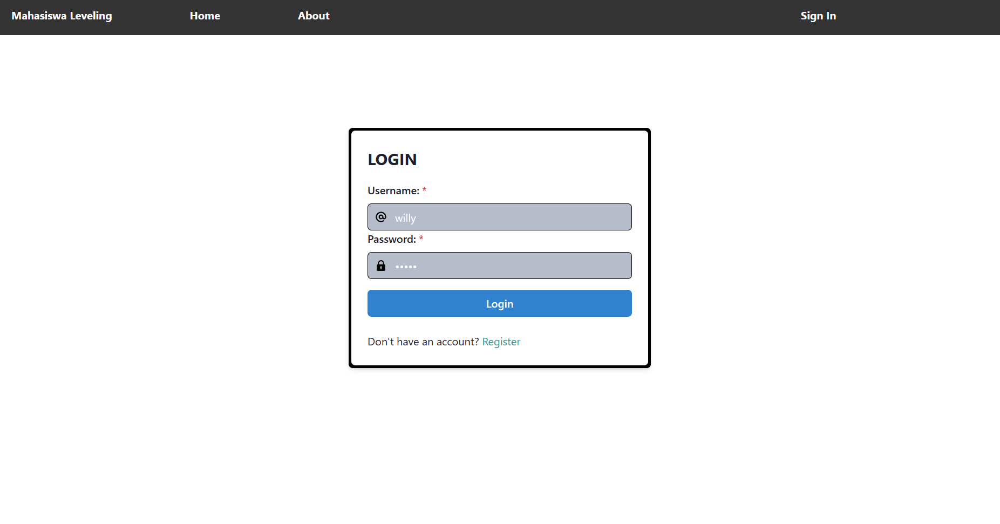
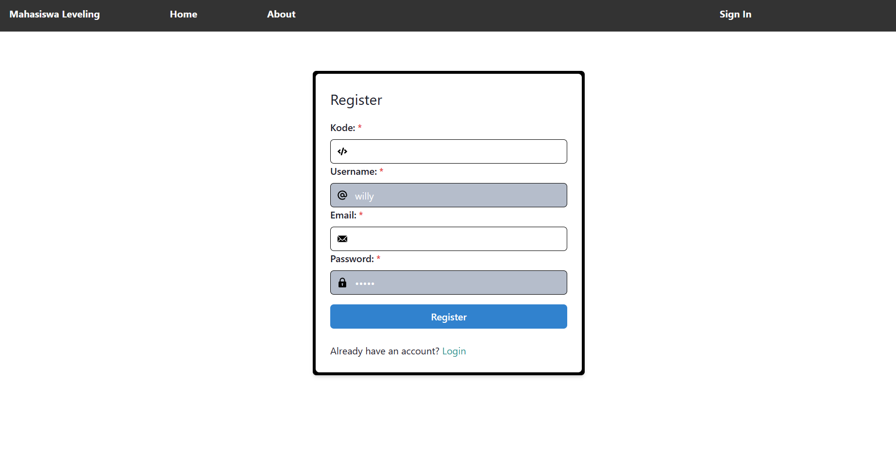
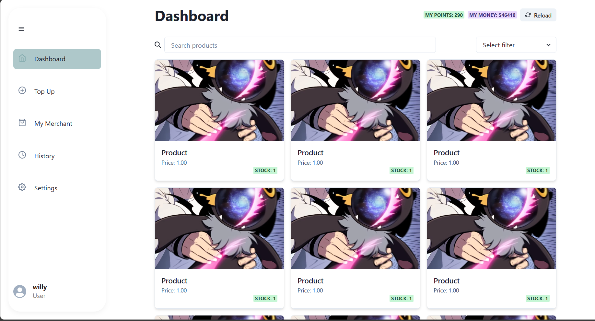
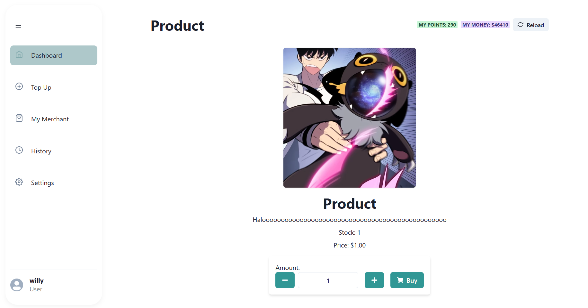
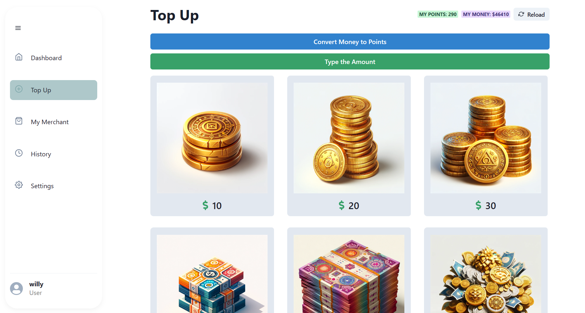
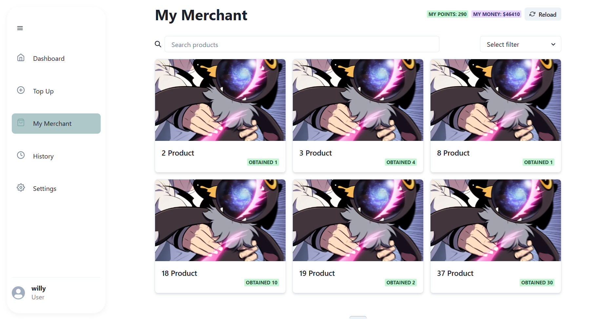
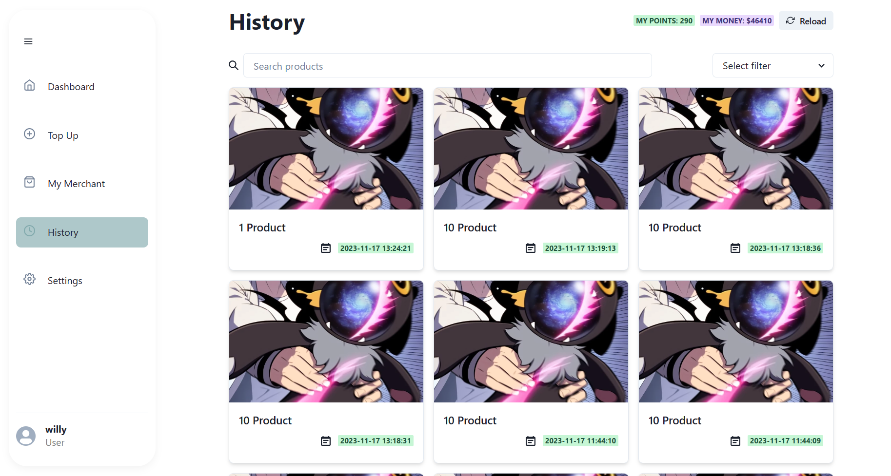
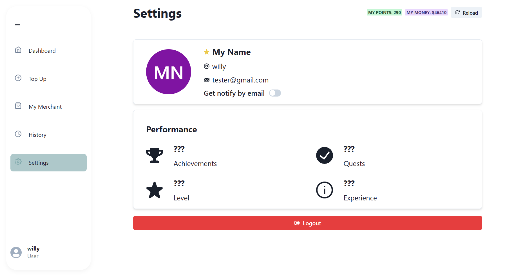
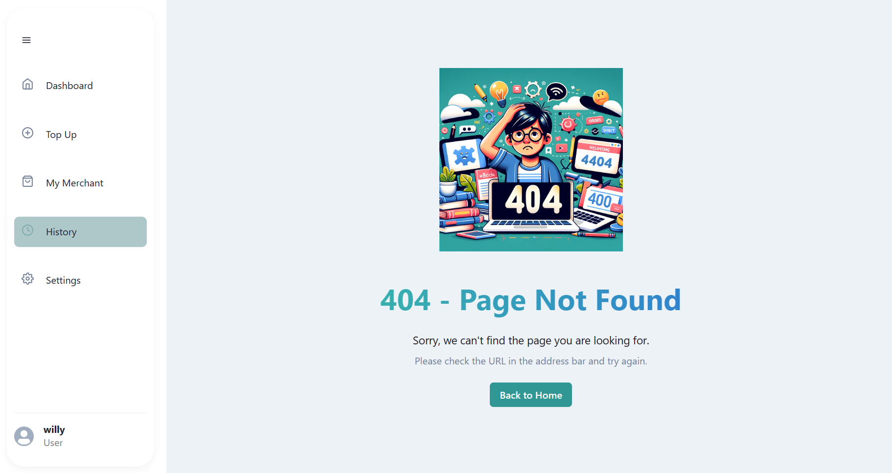

## Team Responsibilities
|Featyre|13521015|13521025|
|-------|--------|--------|
|Initiate Project Setup|✔️||
|Login Page|✔️||
|Register Page|✔️||
|Home Page|✔️||
|About Page|✔️||
|Profile Page|✔️||
|Dashboard Page|✔️||
|Merchandise Page|✔️||
|Product Detail Page|✔️||
|History Page|✔️||
|Top Up Page|✔️||
|Modals|✔️||
|Search Filter Pagination|✔️||
|Sidebar|✔️||
|Navbar|✔️||
|Testing|✔️|✔️|
